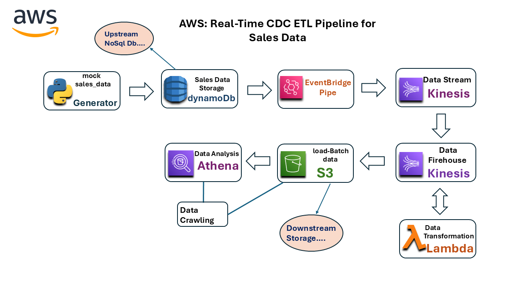

# AWS: Real-Time-CDC-ETL-Pipeline-for-Sales-Data
This project implements a Change Data Capture pipeline on AWS to process and analyze real-time sales data. The pipeline captures changes in a DynamoDB table, streams the data through Kinesis, performs transformations using Lambda, and stores the processed data in S3. The data is cataloged using AWS Glue and made queryable in Athena for analysis.

## Table of Contents

- [Project Overview](#aws-real-time-cdc-etl-pipeline-for-sales-data)
- [Data-Flow Diagram](#data-flow-diagram)
- [Prerequisites](#prerequisites)
- [Pipeline Steps](#pipeline-steps)
- [Usage](#usage)
- [Project Structure](#project-structure)
- [Future Improvements](#future-improvements)
- [Resources](#resources)

## Data-Flow Diagram

Below is an architecture diagram of the pipeline, showing the flow from data generation to querying in Athena.



## Prerequisites

Before setting up the pipeline, ensure you have the following:

- **AWS Account**: Permissions to access DynamoDB, Kinesis, Lambda, S3, Glue, and Athena services.
- **AWS CLI**: Installed and configured with credentials that have the necessary permissions.
- **Python 3.10/11/12**: For generating mock sales data and managing dependencies.
- **Boto3**: AWS SDK for Python, which allows Python code to interact with AWS services.


---

## **Pipeline Steps**

### Step 1: Generate Mock Sales Data and Load into DynamoDB

Create a Python script named data_generator.py that generates mock sales data and inserts it into a DynamoDB table. The script should first ensure the DynamoDB table exists before inserting the data.

Use the [`data_generator.py`](data_generator.py) script to connect to a DynamoDB table named `SalesData`, generates random sales data, and inserts it as individual records. Ensure you have already created the `SalesData` table with `OrderID` as the primary key.

### Step 2: Stream Data from DynamoDB to Kinesis via EventBridge Pipe

- **Create a Kinesis Data Stream**:  
   In the AWS Console, navigate to **Kinesis** > **Data Streams**, and create a new stream (e.g., `SalesDataStream`). Make note of the stream's name for the upcoming configurations.

- **Configure EventBridge Pipe**:  
   Set up an EventBridge Pipe to listen for new records in the DynamoDB table and send them to the Kinesis Data Stream.

   - Go to the **EventBridge Console** > **Pipes**, and create a new pipe.
   - **Source**: Select **DynamoDB** as the source, choose the `SalesData` table, and set the pipe to listen for `INSERT` events.
   - **Target**: Select **Kinesis Data Stream** and specify the `SalesDataStream` created in step 1.

For more detailed instructions, refer to the [AWS EventBridge Pipes Documentation](https://docs.aws.amazon.com/eventbridge/latest/userguide/eventbridge-pipes.html).

### Step 3: Transform Data in Kinesis Firehose with Lambda and Store in S3

To process the streamed data further, we set up a Kinesis Firehose delivery stream that takes records from the Kinesis Data Stream, applies a transformation using a Lambda function, and stores the transformed data in an S3 bucket.

- **Create an S3 Bucket**:  
   Set up an S3 bucket (e.g., `sales-data-processed`) to store the processed sales data.

- **Set Up a Lambda Transformation Function**:  
   Configure a Lambda function to transform the data. This function extracts useful columns (e.g., `OrderID`, `Product`, `Quantity`, and `TotalPrice`) and reformats the data as required. The Lambda function code     can be found in [`lambda_function.py`](lambda_function.py).

- **Create a Kinesis Firehose Delivery Stream**:  
   - Source: Configure the delivery stream to read from `SalesDataStream` in Kinesis.
   - Transformation: Attach the Lambda function for processing.
   - Destination: Set the delivery stream to store the transformed data in the `sales-data-processed` S3 bucket.
 
### Step 4: Catalog Data with Glue and Query in Athena

To enable easy querying and analysis of the processed data in S3, we set up an AWS Glue crawler to catalog the data and use Athena to perform SQL queries.

- **Create a Glue Crawler**:  
   Configure a Glue crawler to scan the `sales-data-processed` S3 bucket, automatically detecting the schema and creating a table in the Glue Data Catalog.

- **Run the Glue Crawler**:  
   Execute the crawler to populate the catalog with schema information. This will allow Athena to recognize the structure of the data stored in S3.

- **Query Data in Athena**:  
   Once the catalog is updated, use Athena to query the processed data. For example, you can run SQL queries to analyze sales trends or product performance:
   
   ```sql
   SELECT * FROM sales_data WHERE Product = 'Laptop';

---
## Usage

Follow these steps to run the ETL pipeline and verify that each component is working as expected.

- **Run the Data Generator Script**  
   Use the [`data_generator.py`](data_generator.py) script to populate the DynamoDB table with sample sales data. This triggers the pipeline to start processing data:

   ```bash
   python data_generator.py
---

## Project Structure

Below is an overview of the project structure and key files:

```plaintext
Real-Time-CDC-ETL-Pipeline-for-Sales-Data/
│
├── data_generator.py       # Script for generating mock sales data and loading it into DynamoDB
├── lambda_function.py      # Lambda function for transforming Kinesis data before storage in S3
├── README.md               # Project documentation with setup and usage instructions
└── architecture.png        # Architecture diagram depicting the ETL pipeline workflow
```

## Future Improvements
**Real-Time Business Insights with Dashboarding Tools**  
   Integrate a dashboarding tool like AWS QuickSight, Tableau, or Power BI to visualize real-time business insights from the processed data. This would allow stakeholders to access up-to-date metrics and key business insights through interactive dashboards, enabling data-driven decision-making.


---
## Resources

### AWS Documentation
- [Amazon DynamoDB Documentation](https://docs.aws.amazon.com/dynamodb/)
- [Amazon Kinesis Documentation](https://docs.aws.amazon.com/kinesis/)
- [AWS Lambda Documentation](https://docs.aws.amazon.com/lambda/)
- [AWS Glue Documentation](https://docs.aws.amazon.com/glue/)
- [Amazon S3 Documentation](https://docs.aws.amazon.com/s3/)

### Third-Party Tools and Libraries
- [Boto3 Documentation (AWS SDK for Python)](https://boto3.amazonaws.com/v1/documentation/api/latest/index.html)
- [AWS QuickSight Documentation](https://docs.aws.amazon.com/quicksight/)

### Tutorials and Articles
- [AWS Data Pipeline Overview](https://aws.amazon.com/datapipeline/)
- [Building a Real-Time Data Pipeline with Kinesis](https://aws.amazon.com/blogs/analytics/building-a-real-time-data-pipeline-with-kinesis/)


